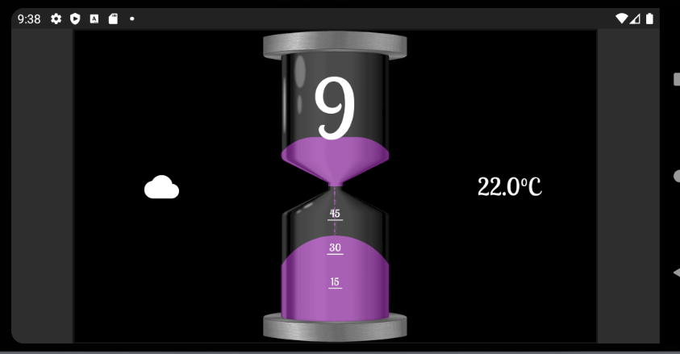
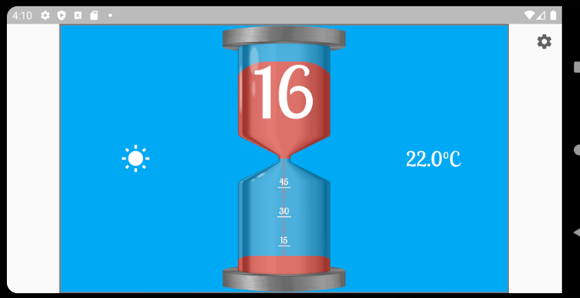

# Hourglass Clock

This is not really an analog or digital clock.... it's an hourglass clock!
The hour is at the top of the hourglass and the sand fills up the bottom to show the minutes. At the change of each hour the hourglass will spin and shrink away, then new hourglass with the new hour will spin back into place.
Weather is on the left and tempeture is on the right.

